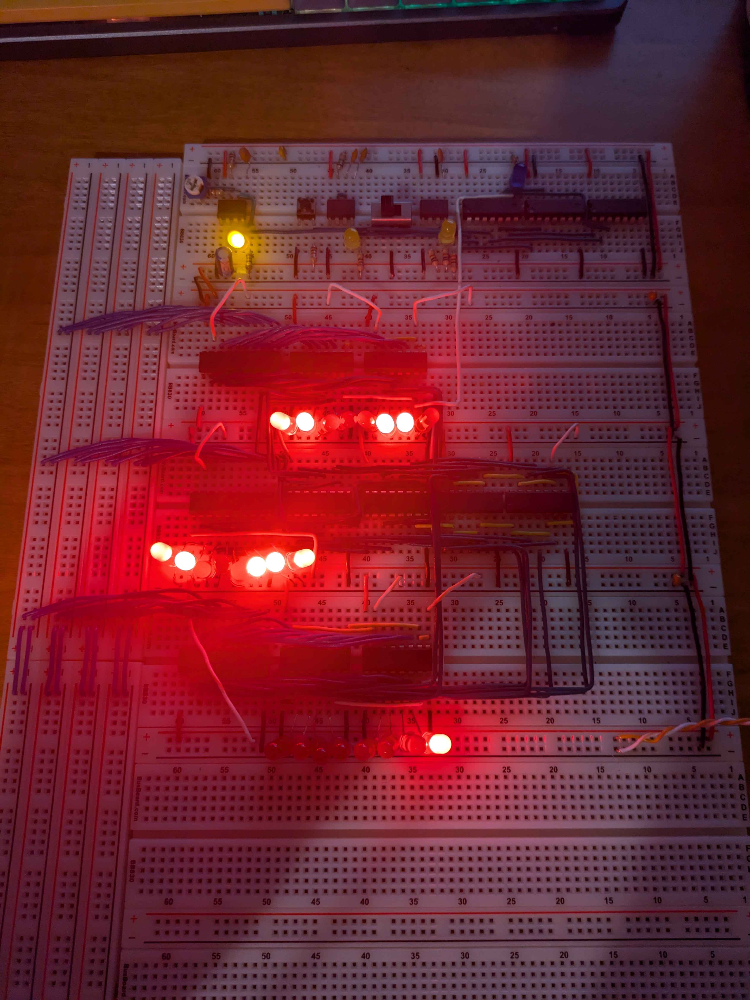
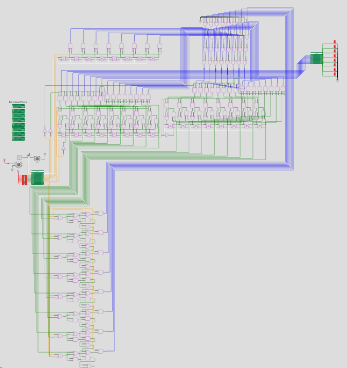

   

# Tiny Tapeout Wokwi 8-Bit ALU 

## Big Thanks

This project was sponsored by the MITRE Corporation and MIT/LL Beaverworks Summer Institute, please see the end of this section for a link to more details.

This project was created as an extension of the Basics of ASICs program offered by BWSI due to extra availability. I completed the Cyber Ops course there and had an amazing time learning about a variety of different technologies and the ways they can be abused. We attended lectures every morning with the staff for our course, lectures during lunch over a variety of topics, and completed labs in the afternoon to solidify our understanding. It was by far one of the best experiences I've had working on technology with other students from around the U.S. (and around the world if I'm not mistaken). I appreciated the ability to meet a wide array of people that all shared a similar interest and curiosity. Without the opportunities that BWSI facilitated, I would not be able to create any of this -- a massive thanks to them.

If you are able, I would certainly recommend taking any of the courses. You can find more information here: [https://beaverworks.ll.mit.edu/CMS/bw/](https://beaverworks.ll.mit.edu/CMS/bw/).

## Description

A simple 8-bit ALU created using Wokwi. It was a joy to create and allowed me to block out a design (of which I also created a breadboard :)). While originally intended to become a full-fledged CPU, after creating a 16-byte RAM module and noting the intense lag (~3 seconds to reroute a wire), I ended up settling on leaving it how it is now.

It is complete with two registers, an 8-bit data bus, a shift register that can be controlled by the user, tri-state logic on all interactions with the bus, and an ALU capable of addition and subtraction.

Please check the documentation for more information! You can find information on the pinout and more details on the underlying methods used there. You should be able to view a couple diagrams explaining the internals in the documentation.

- [Read the documentation for project](docs/info.md)
- [Visit the project itself on Wokwi](https://wokwi.com/projects/407852791999030273)

You can see here the physical design built with a breadboard. A lot of the logic written explicitly in the Wokwi project is simplified through the use of boards that perform declared functionality (e.g. the use of SN74LS283 instead of the logic gates in the Wokwi project).

There's an included video in this repository that demonstrates the breadboard working. (Not shown on camera, the number one was loaded into Register B then the ALU was told to output on the bus and Register A  was told to listen to the bus. Thus, stepping the clock adds 1 to Register A and stores the contents of the ALU in register A. This increments Register A. As you turn the clock up, you can see Register A increment faster.)

You should be able to see a very zoomed out diagram of the circuit as designed in Wokwi. A lot of the nuance cannot be seen in this picture due to wires not rendering in such a close proximity, but the high level overview can be seen. The documentation itself will walk through individual parts if you would like to learn more.

Towards the left, the green chip represents the inputs. This is hooked up serially to the shift-register which allows the user to manually control the bus. The bus (blue) controls the two registers that can be seen towards the middle via a tri-state buffer. These then control the ALU (the vertical section in the bottom). The output is all the way on the right and simply represents the contents of the bus.

## What is Tiny Tapeout?

Tiny Tapeout is an educational project that aims to make it easier and cheaper than ever to get your digital and analog designs manufactured on a real chip.

To learn more and get started, visit https://tinytapeout.com.

